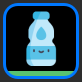
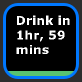
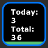
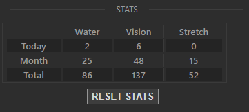

<h1 align="center">Health Reminders</h1>
<p align="center">
    
</p>
<p align="center">
  Build and sustain healthy habits with the help of Stream Deck ❤️
</p>

[DEMO VIDEO](https://www.youtube.com/watch?v=ZrYUA8Jl08M)

## Instructions

1. Choose the type of reminder you are interested on, for now you can choose between:

   - **Drink water** regularly to [stay hydrated](https://www.health.harvard.edu/staying-healthy/how-much-water-should-you-drink)
   - **Relax your vision** to [prevent eye strain](https://en.wikipedia.org/wiki/Computer_vision_syndrome#:~:text=One%20of%20the%20catch%20phrases,from%20the%20optometrist%20and%20ophthalmologist.)
   - **Get up and stretch** to prevent [poor blood circulation and slouching](https://en.wikipedia.org/wiki/Sitting#Health_risks)
   
<p align="center">
  
  
  
</p>

2. Select the amount of time between reminders to best accommodate your preferences
3. **Press the action key** in your Stream Deck to cycle between the display modes:

   - **Icon mode** displays the reminder type icon
   - **Countdown mode** shows the time remaining
   - **Stats mode** let's you check how many times you completed the reminder
   
<p align="center">
  
  
  
</p>

4. **Hold the action key** in your Stream Deck to reset the reminder once you have drunk, stretched...
5. Check your stats in the Stream Deck software to see how many times you've completed the different reminders today, the last month or in total. Reset them if you want!

<p align="center">
  
</p>

## Download (WINDOWS ONLY)

[Packaged direct download](https://github.com/Jorkoh/Stream-Deck-Health-Reminders/raw/master/com.jorkoh.health.reminders.streamDeckPlugin)

## Build

- Project>Manage NuGet Packages>Update all
- Project>Properties>Build>Output path: `..\..\com.jorkoh.health.reminders.sdPlugin\`
- Solution>Properties>Configuration Properties>Configuration>Release
- Mark all resources as `Copy always`
- Build
- On projects root (outside of repo folder) place [`DistributionTool.exe`](https://developer.elgato.com/documentation/stream-deck/sdk/packaging/)
- On projects root (outside of repo folder) create a folder named `install_output`
- On projects root (outside of repo folder) create `install.bat` with this content:
```
setlocal
SET OUTPUT_DIR=".\install_output"
SET DISTRIBUTION_TOOL="DistributionTool.exe"
SET STREAM_DECK_FILE="C:\Program Files\Elgato\StreamDeck\StreamDeck.exe"
SET STREAM_DECK_LOAD_TIMEOUT=4

taskkill /f /im streamdeck.exe
taskkill /f /im %2.exe
timeout /t 2
del %OUTPUT_DIR%\%2.streamDeckPlugin
%DISTRIBUTION_TOOL% -b -i %2.sdPlugin -o %OUTPUT_DIR%
rmdir %APPDATA%\Elgato\StreamDeck\Plugins\%2.sdPlugin /s /q
START "" %STREAM_DECK_FILE%
timeout /t %STREAM_DECK_LOAD_TIMEOUT%
%OUTPUT_DIR%\%2.streamDeckPlugin
```
- Run with `install.bat RELEASE com.jorkoh.health.reminders`
- Plugin auto-installs and is packaged in `install_output`
